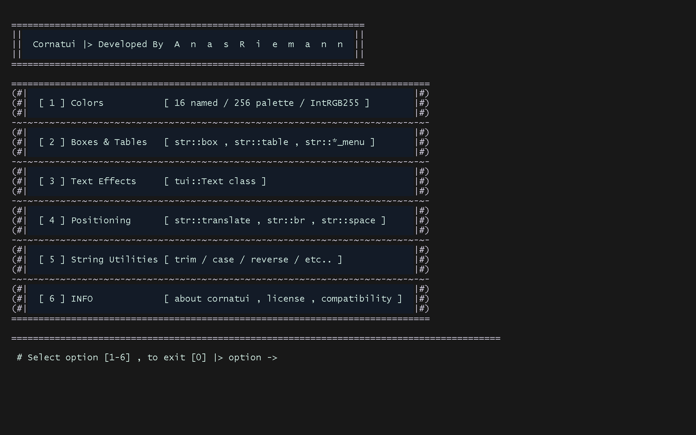
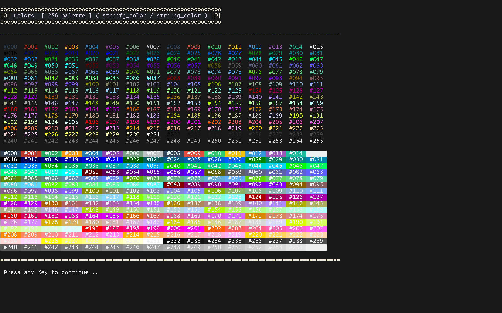
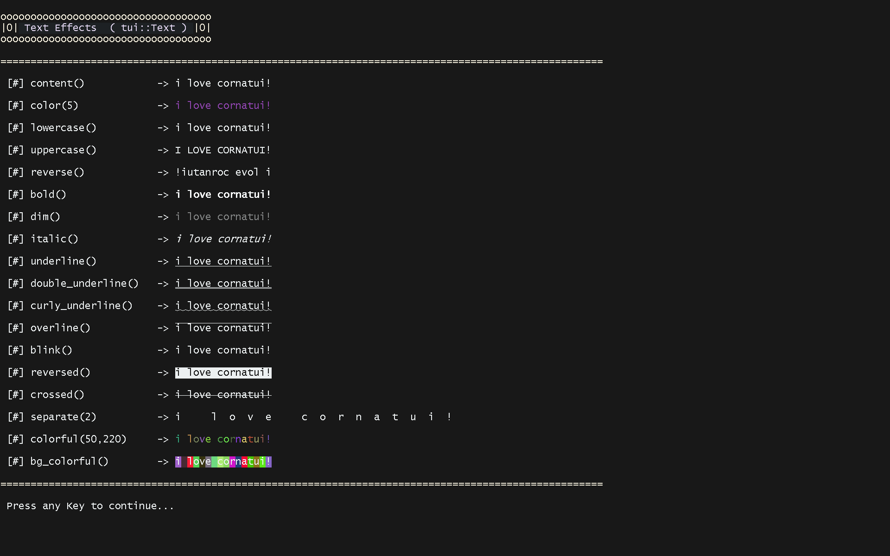

<div align="center">

# cornatui

**A lightweight, header-only C++ library for building retro text UIs in the terminal**
*Colors · Boxes & Tables · Text Effects · Menus · Positioning · Cross-Platform*

[](./LICENSE)
[](https://en.cppreference.com/w/cpp/17)
[]()
[]()

</div>

<br>

<p align="center">
  <sub>Everything you need to dress up a C++ console app — colored text, bordered boxes and tables,<br>true RGB color, precise text positioning, and small numeric/string helpers — split across a small set of headers instead of one giant file, and with zero external dependencies.</sub>
</p>

---

## 1) Overview

`cornatui` is a **fully header-only** library (no build step, no package manager, no third-party dependency). In the current version it's split into **9 files**, each owning a clear slice of functionality, all pulled in automatically once you `#include "cornatui.hpp"`.

The core rule that governs the whole API: **anything that builds structured output (boxes, tables, menus, rules, colored text) lives under `tui::str::*` and only ever returns a `std::string` or a `std::string_view` constant — nothing is printed directly.** A small set of genuinely interactive/direct-print utilities (`pause`, `display_cursor`, `cls`, `init_terminal`, `restore_terminal`) live under `tui::*` (without `str::`) because they act on the real console.

> **Note for anyone upgrading from an older version:** this release dropped the `rang.hpp` dependency entirely and reorganized several utilities into new files/namespaces. See [§8 Known Limitations & Breaking Changes](#8-known-limitations--breaking-changes-from-previous-versions) before porting old code.

---
---
## Cornatui
<p align="center">
  <br>
  <sub>Colored box + table menu rendered in Git Bash</sub>
</p>
---

## 2) Features

- **Boxes & tables** — `str::box()` for a single bordered block of text, `str::table()` for a bordered, row-per-item list, in **nine** border styles: `single`, `bold`, `star`, `hash`, `cross`, `wave`, `mix`, `bubble`, `retro`
- **Menus & list helpers** — `str::ordered_menu()` builds a numbered menu (header + numbered list + selection prompt) in one call, 1D or 2D; `str::prefix_each()` and `str::join()` for building custom prefixed/joined lists
- **Two color tiers, dependency-free** — the full 256-color indexed ANSI palette via `fg_color(n)`/`bg_color(n)`, and true RGB color via `ans::IntRGB255`. No third-party terminal library required anymore
- **`ans::IntRGB255`** — a clamped RGB color value type (`unsigned char` per channel) with `.to_hex()` / `from_hex()`, `+`/`-` blending, `scale()`, `lerp()`, `distance()`, `contrast()`, `to_ansi256()`, and the originals `white()`, `black()`, `inverse()`, `brightness()`, `darkness()`
- **`Text` class** for one-off formatting: `bold`, `dim`, `italic`, `underline`, `double_underline`, `curly_underline`, `overline`, `blink`, `rblink`, `reversed`, `conceal`, `crossed`, plus `uppercase()`, `lowercase()`, `reverse()`, `separate()` (these four now return a `Text`, not a raw string, so they can be chained), stream `operator<<`/`operator>>`, and `colorful()`/`bg_colorful()` with an `enableRGB` switch between random indexed color and random true RGB per character
- **Style constants** under `str::` (`str::bold`, `str::italic`, `str::underline`... `str::reset`) are `constexpr std::string_view` values — no parentheses, just the raw ANSI escape code
- **String utilities** — `lowercase`, `uppercase`, `reverse`, `ltrim`, `rtrim`, `trim`, `ignore_character`, `ignore_spaces`, `get_ascii_only`, `validate_box_content`, `separate`, and the new `center()` / `truncate()`
- **Number formatting** via templated `str::to_fixed_trimmed<T>()` (fixed precision, trailing zeros trimmed) and `str::to_scientific<T>()` (scientific notation)
- **Text positioning** via `str::translate()`, using either plain padding or raw ANSI cursor-movement codes (`Method::padding` / `Method::ansi`)
- **Screen control** via the `Screen` enum (`off`, `view`, `full`) for `cls()`
- **Terminal bell / beep** via `tui::sound::ring()` (and `tui::sound::beep()` on Windows), now in its own header
- **Generalized math/numeric helpers** in `ans::` — `get_random_number()`, `count_character()`, and templated `max_value<T>()`, `is_integer<T>()`, `factorial<T>()`, `get_sum<T>()`, `get_product<T>()`, `apply_function_sequence<T>()`, `cycle<T>()` (one template covers integers and floating types instead of separate overloads)
- **Small utilities**: `hr`, `line`, `br`, `space`, `pause`, `cls`, `display_cursor`, `delay_ms` (now `tui::time::delay_ms`), `check_break_keywords`, `init_terminal`, and the new `restore_terminal()`
- **Header-only, zero dependencies** — drop the files in and go, no build step, no package manager, no `rang.hpp` to vendor
- Optional **`CORNATUI_DISABLE_WIN32`** macro to compile out the Windows console API code path (define it *before* including `cornatui.hpp`)

---
---
## examples : colors & text effects
|   | |
|:---:|:---:|
|  |  |
---

## 3) Project Structure

The library is split into small, single-responsibility files:

| File | Responsibility |
|---|---|
| `cornatui.hpp` | The main glue file — includes every other file, in dependency order, and leaves `namespace tui` otherwise empty |
| `cornatui_math_utilities_ans.hpp` | `struct ans::IntRGB255` (clamped RGB color, now with hex round-tripping, blending, `lerp`, `distance`, `contrast`), `ans::constant::PI`/`EPSI`, `get_random_number()`, `count_character()`, and templated numeric helpers (`max_value`, `is_integer`, `factorial`, `get_sum`, `get_product`, `apply_function_sequence`, `cycle`) |
| `cornatui_time.hpp` | `tui::time::delay_ms()` — the library's only time-related helper now |
| `cornatui_io.hpp` | `enum Screen`, `str::cls()`, `check_break_keywords()`, and the direct-print `pause()`, `display_cursor()`, `cls()` |
| `cornatui_sound.hpp` | `tui::sound::ring()` and, on Windows, `tui::sound::beep()` |
| `cornatui_color.hpp` | `str::fg_color`/`bg_color` (indexed and `IntRGB255` overloads), the `str::bold`/`str::italic`/... style constants, and `init_terminal()` / `restore_terminal()` |
| `cornatui_text.hpp` | `enum Method`, string utilities (`trim`, `translate`, `br`, `hr`, `line`, `center`, `truncate`, `to_fixed_trimmed`, `to_scientific`, `separate`...), and the `Text` class |
| `cornatui_table.hpp` | `enum Border`, `struct BorderStyle`, and every `box()`/`table()` overload (uncolored, colored via `IntRGB255`, colored via raw indexed color) |
| `cornatui_page.hpp` | `enum Page` (reserved for future use), `ordered_menu_list`/`unordered_menu_list`/`ordered_menu` (1D and 2D), and the new `prefix_each()` / `join()` |

Everything lives under `namespace tui`, with string-returning functions under `tui::str`, color values under `ans::IntRGB255`, time helpers under `tui::time`, and terminal-bell helpers under `tui::sound`.

---

## 4) Requirements

- A **C++17**-capable compiler
- No external dependencies — `rang.hpp` is no longer required or used
- `cornatui_math_utilities_ans.hpp`, `cornatui_time.hpp`, `cornatui_io.hpp`, `cornatui_sound.hpp`, `cornatui_color.hpp`, `cornatui_text.hpp`, `cornatui_table.hpp`, `cornatui_page.hpp` — all required alongside `cornatui.hpp`, since it includes every one of them
- On Windows, `<windows.h>` / `<conio.h>` are used automatically unless `CORNATUI_DISABLE_WIN32` is defined before including the header

## 5) Install

Copy all the files into your project together:

```
your_project/
├── cornatui.hpp
├── cornatui_math_utilities_ans.hpp
├── cornatui_time.hpp
├── cornatui_io.hpp
├── cornatui_sound.hpp
├── cornatui_color.hpp
├── cornatui_text.hpp
├── cornatui_table.hpp
├── cornatui_page.hpp
└── main.cpp
```

```cpp
#include "cornatui/cornatui.hpp"  // this pulls in every other file automatically
```

## 6) Quick Start

```cpp
#include "cornatui/cornatui.hpp"

int main()
{
    tui::init_terminal();

    std::cout
        << tui::str::cls()
        << tui::str::translate(
               tui::str::box(
                   "Hello, cornatui!",
                   tui::Border::bold,
                   ans::IntRGB255(220, 250, 255),  // text color
                   ans::IntRGB255(25, 20, 45),     // background color
                   ans::IntRGB255(255, 105, 180),  // border color
                   1                                // padding
               ),
               2, 1
           );

    tui::Text msg = {"I love C++"};
    std::cout << msg.color(ans::IntRGB255(80, 160, 255)) << "\n"; // true RGB
    std::cout << msg.color(5u) << "\n";                            // indexed color
    std::cout << msg.colorful() << "\n";                           // random RGB per char

    // style constants are string_view values now — no parentheses
    std::cout << tui::str::bold << "done" << tui::str::reset << "\n";

    tui::restore_terminal();
}
```

## 7) API Reference

### `namespace tui` — direct-print / interactive functions

| Function | File | Description |
|---|---|---|
| `init_terminal()` | `cornatui_color.hpp` | Prepares the console (UTF-8 codepage + VT processing on native Windows console) and returns `true` if every step succeeded; captures the original console state the first time it's called |
| `restore_terminal()` | `cornatui_color.hpp` | Restores the console state captured by `init_terminal()` (Windows only; no-op elsewhere) |
| `pause(message, duration)` | `cornatui_io.hpp` | Typewriter-prints `message` then blocks for a keypress (Windows) or Enter (other platforms) |
| `display_cursor(show, ostream)` | `cornatui_io.hpp` | Shows/hides the terminal cursor |
| `cls(mode, ostream)` | `cornatui_io.hpp` | Clears the screen (direct-print version of `str::cls`) |
| `check_break_keywords(input)` | `cornatui_io.hpp` | `true` if `input` matches an exit keyword (`"0"`, `"_n"`, `"_f"`, `"_q"`, `"exit"`, `"quit"`, `"break"`, `"false"`) |

### `namespace tui::time`

| Function | Description |
|---|---|
| `delay_ms(ms)` | Sleeps the current thread for `ms` milliseconds |

### `namespace tui::sound`

| Function | Description |
|---|---|
| `ring(ostream)` | Prints the terminal bell character (`\a`) |
| `beep(frequency, durationMS)` | Plays a system beep (Windows only, via `Beep()`) |

### `namespace tui::str` — colors & style

| Item | Description |
|---|---|
| `fg_color(IntRGB255)` / `bg_color(IntRGB255)` | Truecolor ANSI code as a string |
| `fg_color(n)` / `bg_color(n)` (`0`–`255`) | Indexed ANSI code as a string |
| `bold`, `dim`, `italic`, `underline`, `blink`, `rblink`, `reversed`, `conceal`, `crossed`, `double_underline`, `curly_underline`, `overline`, `reset` | `constexpr std::string_view` — raw ANSI escape codes. **These are values, not functions**: write `str::bold`, not `str::bold()` |

### `namespace tui::str` — text & number utilities

| Function | Description |
|---|---|
| `lowercase(text)` / `uppercase(text)` / `reverse(text)` | Case conversion / character-order reversal |
| `ltrim(text)` / `rtrim(text)` / `trim(text)` | Strip leading / trailing / both-side whitespace |
| `ignore_character(text, ch)` / `ignore_spaces(text)` | Strip a given character / all spaces from a string |
| `get_ascii_only(text)` | Strip non-ASCII bytes from a string |
| `validate_box_content(text)` | Strip control characters (including DEL) and trim, used internally by `box()`/`table()` |
| `separate(text, space_length=1)` | Insert spaces between characters of a string (returns `""` for an empty/whitespace-only input instead of crashing) |
| `center(text, width, fill=' ')` | Center `text` inside a field of `width`, padded with `fill` |
| `truncate(text, maxLength, ellipsis="...")` | Cut `text` down to `maxLength`, appending `ellipsis` |
| `to_fixed_trimmed<T>(val, precision)` | Format `val` at fixed `precision`, trimming trailing zeros |
| `to_scientific<T>(val, precision)` | Format `val` in scientific notation at the given precision |

### `namespace tui::str` — positioning & spacing

| Function | Description |
|---|---|
| `translate(content, x, y, method)` | Place text at column `x` / row `y`, via `Method::padding` or `Method::ansi` |
| `br(n, method)` / `space(width, method)` | Blank lines / horizontal spacing, in either method |
| `hr(width, fillChar)` / `hr(width, style, lines)` | Horizontal rule as a string |
| `line(width, fillChar)` / `line(width, style)` | A single repeating-character line, no surrounding newlines (used internally by `hr`/`box`/`table`) |
| `cls(mode)` | Clear-screen escape sequence as a string |

### `namespace tui::str` — boxes, tables, menus

| Function | Description |
|---|---|
| `box(text, style=Border::single, padding=0)` | Bordered block of text, uncolored |
| `box(text, style, IntRGB255 textColor, bgColor, borderColor, padding=0)` | Same, colored via `ans::IntRGB255` |
| `box(text, style, unsigned int textColor, bgColor, borderColor, padding=0)` | Same, colored via raw indexed color codes |
| `table(items, style, IntRGB255 x3, padding=0)` | Bordered, row-per-item list, colored via `IntRGB255` |
| `table(items, style, unsigned int x3, padding=0)` | Same, colored via indexed color codes |
| `table(items, style, padding=0)` | Same, uncolored |
| `ordered_menu(header, items)` | Bordered header + numbered list + selection prompt, as a string (1D or 2D) |
| `ordered_menu_list(items)` / `unordered_menu_list(items)` | Numbered / unnumbered list as a string (1D or 2D) |
| `prefix_each(list, prefixFn)` | Prepends `prefixFn(index)` to each element of `list`; **throws `std::invalid_argument` on an empty vector** |
| `join<T>(elements, formatter)` | Concatenates `formatter(element)` for every element; **throws `std::invalid_argument` on an empty vector** |

### `class tui::Text`

Constructed from a string (only ASCII bytes are kept), exposing:

| Method | Description |
|---|---|
| `content()` | The stored (ASCII-filtered) text |
| `operator<<` / `operator>>` | Stream text out to an `ostream`, or read into a `Text` from an `istream` |
| `color(IntRGB255)` / `bg_color(IntRGB255)` | Colorize the whole string with true RGB |
| `color(unsigned int)` / `bg_color(unsigned int)` | Colorize the whole string with an indexed color |
| `bold()`, `dim()`, `italic()`, `underline()`, `double_underline()`, `curly_underline()`, `overline()`, `blink()`, `rblink()`, `reversed()`, `conceal()`, `crossed()` | Text styling, each returns a `std::string` |
| `uppercase()` / `lowercase()` / `reverse()` / `separate(n)` | Return a **new `Text`** (not a raw string) so calls can be chained |
| `colorful(start=0, end=255, enableRGB=true)` / `bg_colorful(start=0, end=255, enableRGB=true)` | Random color per character — true RGB triplets when `enableRGB` is `true`, indexed colors otherwise |
| `merge(paragraph)` *(static)* | Concatenate a `vector<string>` into one string; **throws `std::invalid_argument` if the vector is empty** |

> **Removed in this version:** `Text::write()` and `Text::write_colorful()` (the typewriter animation) are no longer part of the class. Build a manual loop with `tui::time::delay_ms()` if you need that effect. `Text::border()` was already removed in a previous release — use `str::box(txt.content(), style)`.

### `struct ans::IntRGB255`

A clamped 0–255 RGB color value, each channel stored as `unsigned char`.

| Member | Description |
|---|---|
| `IntRGB255(r, g, b)` | Constructs a color; any channel over 255 is clamped to 255 |
| `red()` / `green()` / `blue()` | Read a channel |
| `to_hex()` | Uppercase `"#RRGGBB"` string |
| `from_hex(hex)` *(static)* | Parse a `"#RRGGBB"` (or `"RRGGBB"`) string into a color; returns black on malformed input |
| `to_ansi256()` | Nearest 256-color ANSI palette index |
| `operator<<` | Streams `to_hex()` |
| `operator==` / `operator!=` | Channel-wise equality |
| `operator+` / `operator-` | Per-channel add/subtract, clamped to `[0, 255]` |
| `white()` / `black()` *(static)* | Ready-made white/black color |
| `inverse()` | Invert the color (`white() - *this`) |
| `brightness(v)` | Brighten by multiplying each channel by `v` (clamped) |
| `darkness(v)` | Darken by dividing each channel by `v` (clamped); **`darkness(0)` now returns `black()`** |
| `scale(factor)` | Multiply each channel by a floating-point `factor`, rounded and clamped |
| `lerp(to, t)` | Linear-interpolate toward another color, `t` clamped to `[0, 1]` |
| `distance(other)` | Euclidean distance between two colors in RGB space |
| `contrast()` | Returns `black()` or `white()`, whichever reads better against this color |

### `namespace ans` — math & numeric utilities

| Item | Description |
|---|---|
| `constant::PI` / `constant::EPSI` | `long double` constants |
| `count_character(text, character)` | Count occurrences of a character in a string |
| `get_random_number(min, max)` | Uniformly-distributed random `int` in `[min, max]` |
| `max_value<T>(vector<T>&)` | Largest element of a vector |
| `is_integer<T>(value)` | `true` if `value` is (within `EPSI`) a whole number |
| `factorial<T>(x)` | Factorial of `x`, or `0` if `x < 0` |
| `get_sum<T>(array, size, start=0)` / `get_product<T>(array, size, start=0)` | Sum / product over a raw array |
| `apply_function_sequence<T>(sequence, std::function<T(T)>)` | Map a function over a `vector<T>` |
| `cycle<T>(num1, num2=2)` | `num1 % num2` for integer types, `std::fmod(num1, num2)` for floating types |

> **Removed in this version:** `is_prime()`, `min_value()`, and the entire `ans::unit` namespace (`deg_rad`, `rad_deg`, `grad_rad`, `rad_grad`, `convert_angle`, `min_s`, `s_min`, `hour_s`, `s_hour`, `day_s`, `s_day`, `convert_time`) are no longer part of the library. If your code depends on them, vendor them locally or pin to a previous release.

### Enums

| Enum | Values |
|---|---|
| `tui::Border` | `single` · `bold` · `star` · `hash` · `cross` · `wave` · `mix` · `bubble` · `retro` |
| `tui::Screen` | `off` · `view` · `full` (now declared in `cornatui_io.hpp`) |
| `tui::Method` | `padding` · `ansi` — controls how `str::translate()`, `str::br()`, and `str::space()` position text |
| `tui::Page` | `list` · `paragraph` · `confirm` — declared for upcoming paging features; not yet consumed by any function |

---

## 8) Known Limitations & Breaking Changes from previous versions

**Still true from earlier releases:**
- No direct-print wrappers for structured output — `box`, `table`, `ordered_menu`, `hr`, and `br` only exist as `tui::str::*` string builders; build the full string first, then print it once.
- `str::fg_color(0)` / `str::bg_color(0)` are still not a reset — they return the ANSI code for plain black/black-background. Use `tui::str::reset` to clear styling.
- `Text` keeps ASCII characters only (`get_ascii_only`) — no multi-byte Unicode/UTF-8 support in `Text` content.
- `cls(Screen::full)` clears scrollback in addition to the visible screen; on Windows this uses the native console buffer API, but on other platforms it relies on ANSI sequences that not every terminal honors.
- `tui::Page` is defined but not yet wired into any function.

**New in this version:**
- The `rang.hpp` dependency has been dropped entirely, along with its cross-platform TTY-capability auto-detection and every direct-print color function (`tui::fg_color(int, ostream)`, `bg_color(...)`, `font_style(...)`, `set_color_mode()`, `set_win_term_mode()`, `disable_color()`). `init_terminal()` now only handles native-Windows console setup (UTF-8 + VT), so on Linux/macOS it's effectively a no-op that returns `true`.
- `str::bold`, `str::italic`, and the other style helpers are `std::string_view` **constants**, not functions — code calling `str::bold()` will fail to compile and needs `str::bold`.
- `Text::lowercase()`, `uppercase()`, `reverse()`, and `separate()` now return a `Text` instead of a `std::string`.
- `Text::write()` / `Text::write_colorful()` (typewriter animation) have been removed from the class.
- `Text::merge()` throws `std::invalid_argument` on an empty vector instead of returning `" "`.
- `ans::IntRGB255::darkness(0)` now returns `black()` instead of `white()`.
- `tui::delay_ms()` moved to `tui::time::delay_ms()`.
- `is_prime()`, `min_value()`, and the whole angle/time unit-conversion namespace (`ans::unit::*`) have been removed from the math utilities.
- `str::format_number()` has been replaced by two templated functions, `str::to_fixed_trimmed<T>()` and `str::to_scientific<T>()`.

## 9) Roadmap

Not yet implemented — ideas for future versions:

- [ ] UTF-8 support in `Text`
- [ ] Wire up `Page`-based paging/navigation
- [ ] Automated test suite
- [ ] A lightweight, opt-in animation/typewriter helper to replace the removed `Text::write()`
- [ ] Broader examples/demos for the templated math utilities and the new `IntRGB255` blending functions

## Repository

cornatui repository: [github.com/AnasRiemann/cornatui-lib](https://github.com/AnasRiemann/cornatui-lib.git)

## License

MIT — see [LICENSE](./LICENSE).

## Author

[**Anas Riemann**](https://github.com/AnasRiemann)