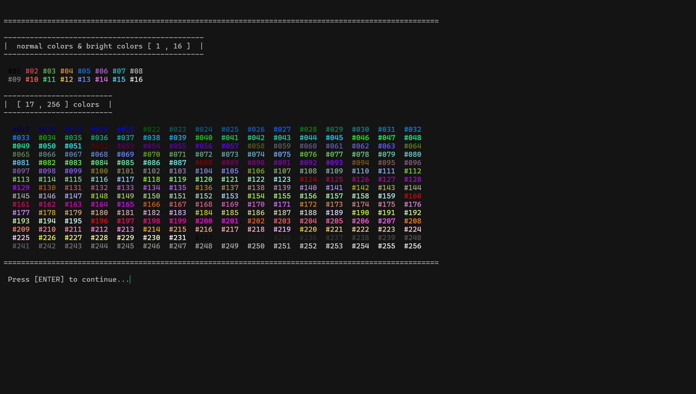

<div align="center">

# cornatui

**A lightweight, header-only C++ library for building retro text UIs in the terminal**
*Colors · Boxes & Tables · Animated Text · Menus · Positioning · Cross-Platform*

[](./LICENSE)
[](https://en.cppreference.com/w/cpp/17)
[]()
[]()

</div>

<br>

<p align="center">
  <sub>Everything you need to dress up a C++ console app — colored text, bordered boxes and tables,<br>a typewriter effect, true RGB color, and precise text positioning — split across a small set of headers instead of one giant file.</sub>
</p>

---

## 1) Overview

`cornatui` is a **fully header-only** library (no build step, no package manager). In the current version it's split into 6 files instead of the single monolithic file used in earlier releases. Each file owns a clear slice of functionality, and they're all pulled in automatically once you `#include "cornatui.hpp"`.

The core rule that governs the whole API hasn't changed: **anything that builds structured output (boxes, tables, menus, rules) lives under `tui::str::*` and only ever returns a `std::string` — nothing is printed directly.** Direct printing to an `std::ostream` (`fg_color`, `bg_color`, `font_style`, `reset`, `cls`, `pause`, `display_cursor`) lives only under `tui::*` (without `str::`).

---
---
## Cornatui
<p align="center">
  <br>
  <sub>Colored box + table menu rendered in Git Bash</sub>
</p>
---


## 2) Features

- **Boxes & tables** — `str::box()` for a single bordered block of text, `str::table()` for a bordered, row-per-item list, in eight border styles: `single`, `bold`, `star`, `hash`, `cross`, `wave`, `mix`, `zero`
- **Menus** — `str::ordered_menu()` builds a numbered menu (header + numbered list + selection prompt) in one call, 1D or 2D
- **Three color tiers** — 16 named colors (rang-backed when `rang.hpp` is available, Windows-safe), the full 256-color ANSI palette, and true RGB color via `ans::IntRGB255` or raw `r,g,b`
- **`ans::IntRGB255`** — a clamped RGB color value type stored as `unsigned char` per channel, with `.hex()`, `+`/`-` blending, and additions like `white()`, `black()`, `inverse()`, `brightness()`, `darkness()`
- **`Text` class** for one-off formatting: `bold`, `dim`, `italic`, `underline`, `double_underline`, `curly_underline`, `overline`, `blink`, `rblink`, `reversed`, `conceal`, `crossed`, `uppercase`, `lowercase`, `reverse`, `separate`, `color`, `bg_color`, `colorful`, `bg_colorful`
- **Free-standing formatting functions** under `str::` (`bold()`, `italic()`, `underline()`... etc.) that return the raw ANSI code, usable without going through `Text` at all
- **Typewriter animation** via `Text::write()` and `Text::write_colorful()`
- **String utilities** — `lowercase`, `uppercase`, `reverse`, `ltrim`, `rtrim`, `trim`, `ignore_character`, `ignore_spaces`, `get_ascii_only`, `validate_box_content`, `separate`
- **Number formatting** via `str::format_number()` — configurable decimal precision, optional trailing-zero trimming, and automatic scientific notation for very large/small values
- **Text positioning** via `str::translate()`, using either plain padding or raw ANSI cursor-movement codes (`Method::padding` / `Method::ansi`)
- **Screen control** via the `Screen` enum (`off`, `view`, `full`) for `cls()`
- **Terminal bell / beep** via `tui::sound::ring()` (and `tui::sound::beep()` on Windows)
- **Small utilities**: `hr`, `line`, `br`, `space`, `pause`, `cls`, `display_cursor`, `delay_ms`, `check_break_keywords`, `init_terminal`
- **Header-only** — drop the files in and go, no build step, no package manager
- Optional **`CORNATUI_DISABLE_WIN32`** macro to compile out the Windows console API code path, and **`CORNATUI_DISABLE_RANG_DOT_HPP`** to compile out the `rang.hpp` dependency (define either *before* including `cornatui.hpp`)

---
---
## examples : colors  & text effects 
|   | |
|:---:|:---:|
|  |  |
---

## 3) Project Structure

The library has been split into small, single-responsibility files, replacing the old `cornatui.hpp` that used to hold everything:

| File | Responsibility |
|---|---|
| `cornatui.hpp` | The main glue file — includes every other file in the right order, and hosts `check_break_keywords()` and `namespace tui::sound` |
| `cornatui_math_ans.hpp` | `struct ans::IntRGB255` (clamped RGB color), the `get_random_number()` generator, and general math helpers (angles, time, sums, primes, etc.) |
| `cornatui_color.hpp` | All color/formatting functions in both flavors: `tui::str::*` (string-returning) and `tui::*` (direct-print to `ostream`), plus `init_terminal()` |
| `cornatui_text.hpp` | `enum Screen`, `enum Method`, all free-standing text utilities (`trim`, `translate`, `br`, `hr`, `line`, `format_number`, `separate`...), the `Text` class, and the direct-print functions `pause`, `display_cursor`, `cls`, `delay_ms` |
| `cornatui_table.hpp` | `enum Border`, `struct BorderStyle` (now declared directly under `namespace tui`, no longer nested inside `str`), and every `box()`/`table()` overload (uncolored, colored via `IntRGB255`, and colored via raw `unsigned int`) |
| `cornatui_page.hpp` | `enum Page` (reserved for future use), and `ordered_menu_list`, `unordered_menu_list`, `ordered_menu` in both their 1D and 2D forms |
| `rang.hpp` | Vendored third-party library for cross-platform terminal colour (optional — a macro can disable it) |
| `LICENSE` | MIT license |

Everything still lives under `namespace tui`, with string-returning functions under `tui::str`, color values under `ans::IntRGB255`, and terminal-bell helpers under `tui::sound`.

---

## 4) Requirements

- A **C++17**-capable compiler
- [`rang.hpp`](https://github.com/agauniyal/rang) in the include path (optional — it only affects the direct-print `fg_color`/`bg_color`/`font_style` helpers; the string-returning `tui::str::*` color functions work fine without it)
- `cornatui_math_ans.hpp`, `cornatui_color.hpp`, `cornatui_text.hpp`, `cornatui_table.hpp`, `cornatui_page.hpp` — all of these are required alongside `cornatui.hpp`, since it includes every one of them
- On Windows, `<windows.h>` / `<conio.h>` are used automatically unless `CORNATUI_DISABLE_WIN32` is defined before including the header

## 5) Install

Copy all the files into your project together:

```
your_project/
├── cornatui.hpp
├── cornatui_math_ans.hpp
├── cornatui_color.hpp
├── cornatui_text.hpp
├── cornatui_table.hpp
├── cornatui_page.hpp
├── rang.hpp          # optional
└── main.cpp
```

```cpp
#include "cornatui/cornatui.hpp"  // this pulls in every other file automatically
```

## 6) Quick Start

```cpp
#include "cornatui/cornatui.hpp"

int main()
{
    tui::init_terminal();

    std::cout
        << tui::str::cls()
        << tui::str::translate(
               tui::str::box(
                   "Hello, cornatui!",
                   tui::Border::bold,
                   ans::IntRGB255(220, 250, 255),  // text color
                   ans::IntRGB255(25, 20, 45),     // background color
                   ans::IntRGB255(255, 105, 180),  // border color
                   1                                // padding
               ),
               2, 1
           );

    tui::Text msg = {"I love C++"};
    std::cout << msg.color(5) << "\n";          // blue text
    std::cout << msg.bg_color(1) << "\n";       // red background
    std::cout << msg.bold() << "\n";            // bold text
    std::cout << msg.colorful(0, 255) << "\n";  // random color per character

    std::cout << tui::str::format_number(3.14159265L, 2) << "\n"; // "3.14"
    std::cout << tui::str::hr(60, "=", 2);
    tui::pause();
    return 0;
}
```

```bash
g++ -std=c++17 -O2 main.cpp -o app
./app
```

---

## 7) API Reference

### `namespace tui` — direct-print functions and general utilities

| Function | From file | Description |
|---|---|---|
| `cls(mode, ostream)` | `cornatui_text.hpp` | Clear the screen (`Screen::off` / `view` / `full`, default `full`) |
| `fg_color(n, ostream)` / `bg_color(n, ostream)` | `cornatui_color.hpp` | Set foreground/background color (1–255) — uses `rang` if available, raw ANSI otherwise |
| `font_style(n, ostream)` | `cornatui_color.hpp` | Set a text style code (bold, dim, italic, etc.) |
| `reset(ostream)` | `cornatui_color.hpp` | Reset all active styling |
| `pause(msg, delay)` | `cornatui_text.hpp` | Type out `msg`, then wait for a key/Enter |
| `delay_ms(ms)` | `cornatui_text.hpp` | Sleep for `ms` milliseconds |
| `display_cursor(show, ostream)` | `cornatui_text.hpp` | Show or hide the terminal cursor |
| `init_terminal()` | `cornatui_color.hpp` | Initializes `rang`'s auto-detection if `rang.hpp` is included; on the native Windows console (no `rang`) also switches the console to UTF-8 and enables ANSI (VT) processing |
| `check_break_keywords(input)` | `cornatui.hpp` | `true` if `input` matches an exit keyword (`"0"`, `"_n"`, `"_f"`, `"_q"`, `"exit"`, `"quit"`, `"break"`, `"false"`) |

### `namespace tui::str` — string-returning functions

**Colors & formatting:**

| Function | Description |
|---|---|
| `fg_color(n)` / `bg_color(n)` | ANSI code as a string (1–255) |
| `fg_color(r,g,b)` / `bg_color(r,g,b)` | Truecolor ANSI code as a string |
| `fg_color(IntRGB255)` / `bg_color(IntRGB255)` | Truecolor ANSI code from an `ans::IntRGB255` value |
| `bold()`, `dim()`, `italic()`, `underline()`, `blink()`, `rblink()`, `reversed()`, `conceal()`, `crossed()`, `double_underline()`, `curly_underline()`, `overline()` | Raw ANSI code for each style, with no content — standalone free functions |
| `reset()` | Style-reset escape sequence (`"\033[0m"`) |

**Text & number utilities:**

| Function | Description |
|---|---|
| `lowercase(text)` / `uppercase(text)` / `reverse(text)` | Case conversion / character-order reversal |
| `ltrim(text)` / `rtrim(text)` / `trim(text)` | Strip leading / trailing / both-side whitespace |
| `ignore_character(text, ch)` / `ignore_spaces(text)` | Strip a given character / all spaces from a string |
| `get_ascii_only(text)` | Strip non-ASCII bytes from a string |
| `validate_box_content(text)` | Strip control characters (including DEL) and trim, used internally by `box()`/`table()` |
| `separate(text, space_length=1)` | Insert spaces between characters of a string |
| `format_number(val, decimal_precision=5, trim_trailing_zeros=true, auto_scientific=false)` | Format a `long double` at a given decimal precision, optionally trimming trailing zeros and auto-switching to scientific notation for very large/small values |

**Positioning & spacing:**

| Function | Description |
|---|---|
| `translate(content, x, y, method)` | Place text at column `x` / row `y`, via `Method::padding` or `Method::ansi` |
| `br(n, method)` / `space(width, method)` | Blank lines / horizontal spacing, in either method |
| `hr(width, fillChar)` / `hr(width, style, lines)` | Horizontal rule as a string |
| `line(width, fillChar)` / `line(width, style)` | A single repeating-character line, no surrounding newlines (used internally by `hr`/`box`/`table`) |
| `cls(mode)` | Clear-screen escape sequence as a string |

**Boxes, tables, menus:**

| Function | Description |
|---|---|
| `box(text, style=Border::single, padding=0)` | Bordered block of text, uncolored |
| `box(text, style, IntRGB255 textColor, bgColor, borderColor, padding=0)` | Same, colored via `ans::IntRGB255` |
| `box(text, style, unsigned int textColor, bgColor, borderColor, padding=0)` | Same, colored via raw indexed color codes (**new**) |
| `table(items, style, IntRGB255 x3, padding=0)` | Bordered, row-per-item list, colored via `IntRGB255`, now with `padding` (**new**) |
| `table(items, style, unsigned int x3, padding=0)` | Same, colored via indexed color codes (**new**) |
| `table(items, style, padding=0)` | Same, uncolored |
| `ordered_menu(header, items)` | Bordered header + numbered list + selection prompt, as a string (1D or 2D) |
| `ordered_menu_list(items)` / `unordered_menu_list(items)` | Numbered / unnumbered list as a string (1D or 2D) |

### `namespace tui::sound`

| Function | Description |
|---|---|
| `ring(ostream)` | Print the terminal bell character (`\a`) |
| `beep(frequency, durationMS)` | Play a system beep (Windows only, via `Beep()`) |

### `class tui::Text`

Constructed from a string (only ASCII bytes are kept), exposing:

| Method | Description |
|---|---|
| `content()` | The stored (ASCII-filtered) text |
| `color(n)` | Colorize the whole string (0–255) |
| `bg_color(n)` | Colorize the whole string's background (0–255) — **entirely new** |
| `bold()`, `dim()`, `italic()`, `underline()`, `double_underline()`, `curly_underline()`, `overline()`, `blink()`, `rblink()`, `reversed()`, `conceal()`, `crossed()` | Text styling |
| `uppercase()` / `lowercase()` | Case conversion |
| `reverse()` | Reverse character order |
| `separate(n)` | Insert `n` spaces between characters (**no default value anymore** — must always be passed) |
| `colorful(start, end)` / `bg_colorful(start, end)` | Random foreground / background color per character |
| `write(delay, ostream)` | Typewriter-style print |
| `write_colorful(delay, start, end)` | Typewriter print with random colors |
| `merge(paragraph)` *(static)* | Concatenate a `vector<string>` into one string |

> Note: the `border(style)` method (which used to return `str::box(content(), style, 0)`) has been **removed entirely** from the `Text` class in the current version. Use `str::box(txt.content(), style)` directly instead.

### `struct ans::IntRGB255`

A clamped 0–255 RGB color value, each channel stored as `unsigned char`, used by the colored `box()`/`table()`/`fg_color()`/`bg_color()` overloads.

| Member | Description |
|---|---|
| `IntRGB255(r, g, b)` | Constructs a color; any channel over 255 is clamped to 255 (not reset to 0) |
| `red()` / `green()` / `blue()` | Read a channel |
| `hex()` | Uppercase `"#RRGGBB"` string |
| `operator+` / `operator-` | Per-channel add/subtract, clamped to `[0, 255]` |
| `white()` / `black()` *(static)* | Ready-made white/black color |
| `inverse()` | Invert the color (`white() - *this`) |
| `brightness(v)` | Brighten the color by multiplying each channel by `v` (clamped) |
| `darkness(v)` | Darken the color by dividing each channel by `v` (clamped, `v=0` returns white) |

### Enums

| Enum | Values |
|---|---|
| `tui::Border` | `single` · `bold` · `star` · `hash` · `cross` · `wave` · `mix` · `zero` |
| `tui::Screen` | `off` · `view` · `full` |
| `tui::Method` | `padding` · `ansi` — controls how `str::translate()`, `str::br()`, and `str::space()` position text |
| `tui::Page` | `list` · `paragraph` · `confirm` — declared for upcoming paging features; not yet consumed by any function |

---

## 8) Known Limitations

- **No direct-print wrappers for structured output.** As always, `box`, `table`, `ordered_menu`, `hr`, and `br` only exist as `tui::str::*` string builders — build the full string first, then print it once.
- **`str::fg_color(0)` / `str::bg_color(0)` are still not a reset.** They return the ANSI code for plain black (`30`/`40`), not `"\033[0m"`. If you want to clear styling, use `tui::str::reset()` (or the direct-print `tui::fg_color(0, ostream)`, which *does* still treat `0` as reset).
- `Text` keeps ASCII characters only (`get_ascii_only`) — no multi-byte Unicode/UTF-8 support in `Text` content yet, even though `init_terminal()` now switches the native Windows console to UTF-8.
- `Text::separate()` indexes `content()[0]` without checking that the string isn't empty after stripping spaces.
- The `Text::border()` method has been **removed** from the current version — any old code using it will need to be replaced with `str::box(txt.content(), style)`.
- The numbered list functions were renamed from `ordered_list`/`unordered_list` to `ordered_menu_list`/`unordered_menu_list` — any old code calling them needs to be updated.
- `edit_precision()` has been removed entirely, replaced by `format_number()` with a different signature and different behavior.
- `cls(Screen::full)` clears scrollback in addition to the visible screen; on Windows this is done via the native console buffer API, but on other platforms it relies on ANSI sequences that not every terminal honors.
- `tui::Page` is defined but not yet wired into any function — reserved for future paging support.

## 9) Roadmap

Not yet implemented — ideas for future versions:

- [ ] UTF-8 support in `Text`
- [ ] Wire up `Page`-based paging/navigation
- [ ] Automated test suite
- [ ] Broader examples/demos for the new colored `box`/`table` overloads

## Repository

cornatui repository: [github.com/AnasRiemann/cornatui-lib](https://github.com/AnasRiemann/cornatui-lib.git)

## License

MIT — see [LICENSE](./LICENSE).

## Author

[**Anas Riemann**](https://github.com/AnasRiemann)